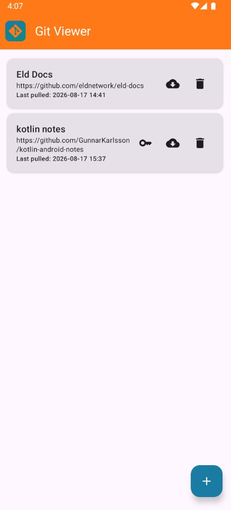
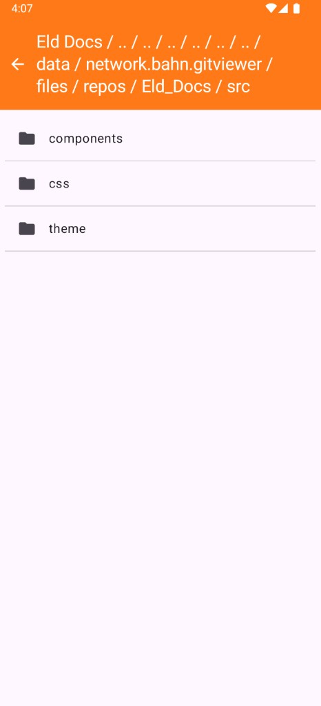

# Git Viewer

An Android app for cloning Git repositories, browsing their files, and reading source or Markdown on the device.

Built with Jetpack Compose, Room, and JGit.

## Screenshots

Home — saved repositories, pull, and SSH keys:



File browser — breadcrumbs from the repo root:



## Features

- Add repositories by HTTPS or SSH URL
- Pull / clone onto the device
- Browse directories with a wrapping breadcrumb path
- Open files as text, with Markdown rendering for `.md`
- Optional per-repo SSH key pair for private GitHub repos (add the public key as a deploy key or account SSH key)
- Confirm before deleting a local clone

## Requirements

- Android 8.0 (API 26) or later
- Android Studio with JDK 17

## Build

Open the project in Android Studio and run the `app` configuration, or:

```bash
./gradlew :app:assembleDebug
```

The debug APK is written to `app/build/outputs/apk/debug/`.

## Private GitHub repos

When adding a repo, leave **Generate SSH key** enabled. Copy the public key into GitHub (repo **Settings → Deploy keys**, or your account SSH keys), then pull. HTTPS GitHub URLs are converted to SSH when a key is present.

## License

[MIT](LICENSE)
